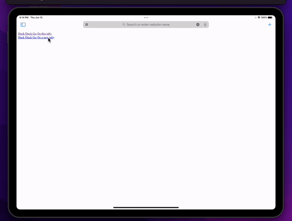

## Content Scripts aren't injected when the tab is opened as a extension page

This demonstrates an issue with content scripts not being injected on iOS 15 after opening from an extension page.

The sample project has a content script which sets the background color to red on DOMContentLoaded. The bug can be shown by:

1. Tapping on the extension toolbar icon which will open the app.html page
1. Tapping the link to open "Duck Duck Go (In a new tab)" and see that a tab opens which has the content script injected
1. Returning to the app page and tap the link "Duck Duck Go (In this tab)" and see that a tab opens which does not have the content script injected

